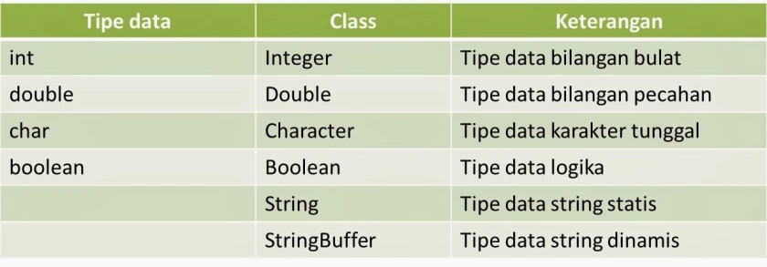

# Pengenalan Dasar

Disini kita belajar tentang tipe data, struktur dasar program, variabel, operator aritmatika dan operator penugasan. Ini berfungsi agar bisa menulis sebuah program yang sederhana.

## Tipe data

Tipe data ada 3 jenis:
1. Primitif
2. Turunan
3. Buatan User

## Variabel 
Untuk membuat variabel ada dua buah istilah yang harus diketahui yaitu deklarasi dan inisialisasi. Deklarasi adalah pernyataan dan inisialisasi pengisian nilai.